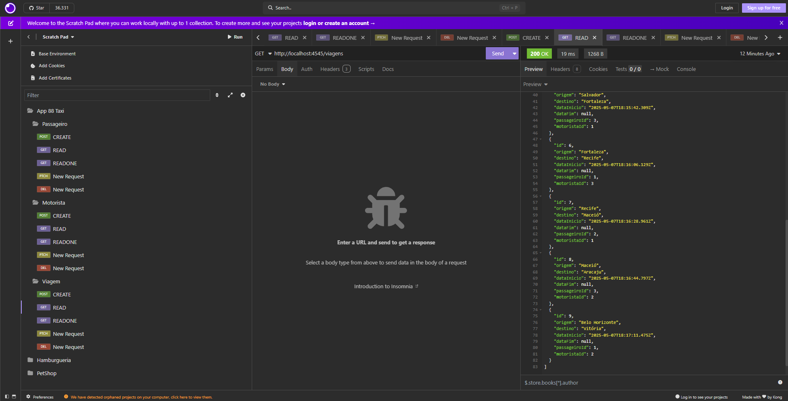

# Projeto app-taxi-rpc-pbe2
Exemplo do projeto de uma API de texi utilizando o framework Node.js e o banco de dados MySQL.
## tecnologias
- Node.js (Framework)
- VsCode (IDE)
- Insomnia (IDE de testes)
- Prisma (ORM)
- XAMPP (IDE) SGBD MySQL
## Estrutura do Projeto

##

## Passo a passo para testar
- 1 Clone este repositório
- 2 Abrir com Vscode
- 3 Criar o arquivo **.env** na pasta API contendo:
```js
DATABASE_URL="mysql://root@localhost:3306/app88taxi"
PORT=4545
```
- Obs: certifique-se de não ter um banco de dados chamado **pizzaria** no seu MySQL.
- 4 Abrir o XAMPP e dar start em MySQL
- 5 No VsCode abra um terminal **CTRL + '** cmd ou bash e digite os seguintes comandos para baixar as dependências e instalar o Banco de dados
```bash
cd api
npm install
npm i prisma -g
npx prisma migrate dev --name init
npx nodemon
# ou
npm start
```
- 6 Abra o Insomnia e importe o arquivo **./docs/insomnia.yaml** para realizar os testes.

## Prints dos testes


